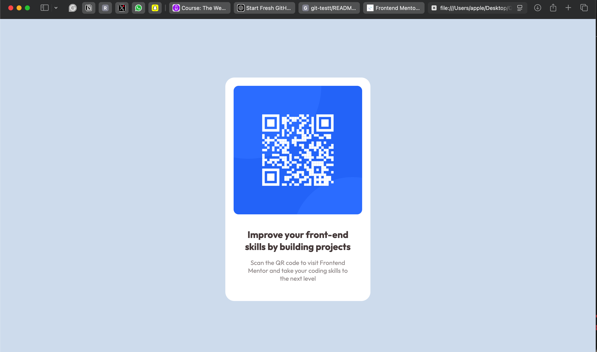

# git-testt
## Table of contents

- [Overview](#overview)
  - [Screenshot](#screenshot)
  - [Links](#links)
- [My process](#my-process)
  - [Built with](#built-with)
  - [What I learned](#what-i-learned)
  - [Continued development](#continued-development)
  - [Useful resources](#useful-resources)
- [Author](#author)
- [Acknowledgments](#acknowledgments)

## Overview

In this project, I built a simple QR code that links a user to a specified website. This challenge from Frontend Mentor provided a solid foundation for working with HTML and CSS. It's a great way to practice building small, functional projects that can be embedded into various applications.

This QR code serves as a visual representation that allows users to scan and quickly navigate to the website.

### Screenshot

### Links
- [GitHub Repository](https://github.com/yourusername/git-testt)
- [View the live demo](https://github.com/Dexterjnr/git-testt/blob/main/README.md?plain=1)

### My Process

### Built With
- HTML
- CSS

### What I Learned
While working on this project, I strengthened my skills with:

Creating simple yet effective HTML structures.
Using CSS for styling and layout, especially when it comes to responsiveness.
Understanding how small projects like this help you build foundational knowledge for larger projects.

### Continued Development
Going forward, I plan to:

Experiment with more advanced CSS properties to make the QR code interactive (e.g., adding hover effects or animations).
Work on enhancing accessibility features such as improving contrast and adding text descriptions for visually impaired users.
Incorporate JavaScript to dynamically generate QR codes based on user input.

### Useful Resources
Frontend Mentor - The platform where I found this challenge and learned a lot.
MDN Web Docs - HTML - A comprehensive resource for understanding HTML tags and their attributes.
MDN Web Docs - CSS - A valuable guide for CSS properties and layout techniques.

### Author

GitHub - @Dexterjnr
Frontend Mentor 
Twitter - @sjoshuachucks

### Acknowledgments

A special thanks to:

Frontend Mentor for providing this challenging and beginner-friendly task.
The web development community for the continuous learning resources and su
